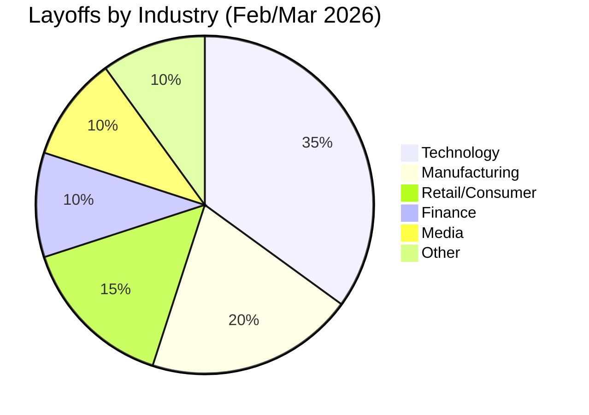

# Layoff News Report: February – March 2026

This report summarizes significant layoff announcements and workforce trends observed between **February 7, 2026**, and **March 7, 2026**.

## Executive Summary
The search reveals a cooling but still active layoff environment. While February saw a 72% decrease in job cuts compared to the previous year, the tech industry continues to lead in reductions. A prominent trend this month is the explicit citation of **Artificial Intelligence (AI)** as a primary driver for restructuring and job elimination.

---

## Major Layoff Announcements

### Technology & Fintech
| Company | Approx. Cuts | Context / Rationale |
| :--- | :--- | :--- |
| **Block (Square)** | 4,000 | CEO cited productivity gains and efficiency from AI. |
| **Oracle** | Up to 30,000* | Shifting resources toward AI-native offerings; potential for massive long-term restructuring. |
| **Amazon** | 16,000 | Ongoing reductions following earlier 2025 cuts. |
| **Meta** | 1,000+ | Scaling back Reality Labs (metaverse) to focus on other priorities. |
| **Pinterest** | ~15% of staff | Reallocating resources specifically into AI-focused roles. |

*Note: Oracle cuts are a mix of confirmed recent actions and reported long-term projections.*

### Finance & Professional Services
- **Morgan Stanley**: Cut 2,500 employees (3% of workforce) across all divisions.
- **Ergo (German Insurer)**: Announced 1,000 cuts through 2030, citing AI automation of insurance tasks.

### Consumer Goods, Retail & Manufacturing
- **Heineken**: Cutting 6,000 jobs (7% of workforce) due to weak global beer demand.
- **UPS**: Planning up to 30,000 operational cuts to reduce reliance on Amazon deliveries.
- **Nike**: 775 jobs, primarily in distribution, as supply chains move toward automation.
- **Target**: 500 roles in corporate/regional offices, redirecting investment to in-store labor.
- **Panasonic**: 2,000 additional employees laid off.

### Media
- **The Washington Post**: Cut one-third of newsroom and departmental staff.

---

## Key Industry Trends

### 1. The "AI Shift"
Unlike previous years where "economic headwinds" were the sole excuse, companies like **Block**, **Oracle**, and **Ergo** are now explicitly linking layoffs to AI-driven productivity gains. Resources are being aggressively reallocated from legacy roles to AI development and implementation.

### 2. Automation in Logistics
Companies like **Nike** and **UPS** are reducing headcount in manual distribution and operational roles as they invest in automated supply chain technologies.

### 3. Tech Dominance in Cuts
Despite the overall decline in total job cuts compared to last year, the tech sector remains the most volatile, with a 51% increase in year-to-date layoffs compared to early 2025.

---

## Data Visualization (Summary)

> [!NOTE]
> Data is gathered from major business news outlets including Forbes, Fox Business, and Challenger, Gray & Christmas. Projected numbers for companies like Oracle are based on analyst reports and internal leaks.